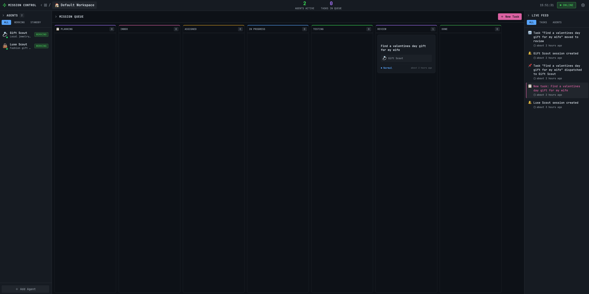

<p align="center">
  
</p>

<h1 align="center">🦞 Mission Control</h1>

<p align="center">
  <strong>AI Agent Orchestration Dashboard</strong><br>
  Create tasks. Plan with AI. Dispatch to agents. Watch them work.
</p>

<p align="center">
  
  
  
  
  
</p>

<p align="center">
  <a href="https://missioncontrol.ghray.com"><strong>🎮 Live Demo</strong></a> •
  <a href="#-quick-start">Quick Start</a> •
  <a href="#-features">Features</a> •
  <a href="#-how-it-works">How It Works</a> •
  <a href="#-configuration">Configuration</a> •
  <a href="#-contributors">Contributors</a>
</p>

---

## ✨ Features

🎯 **Task Management** — Kanban board with drag-and-drop across 7 status columns

🧠 **AI Planning** — Interactive Q&A flow where AI asks clarifying questions before starting work

🤖 **Agent System** — Auto-creates specialized agents, assigns tasks, tracks progress in real-time

🔌 **OpenClaw Integration** — WebSocket connection to [OpenClaw Gateway](https://github.com/openclaw/openclaw) for AI agent orchestration

🔒 **Security First** — Bearer token auth, HMAC webhooks, Zod validation, path traversal protection, security headers

📡 **Live Feed** — Real-time event stream showing agent activity, task updates, and system events

🌐 **Multi-Machine** — Run the dashboard and AI agents on different computers (supports Tailscale for remote)

---

## 🏗 Architecture

```
┌──────────────────────────────────────────────────────────────┐
│                       YOUR MACHINE                           │
│                                                              │
│  ┌─────────────────┐          ┌──────────────────────────┐  │
│  │ Mission Control  │◄────────►│    OpenClaw Gateway      │  │
│  │   (Next.js)      │   WS     │  (AI Agent Runtime)      │  │
│  │   Port 4000      │          │  Port 18789              │  │
│  └────────┬─────────┘          └───────────┬──────────────┘  │
│           │                                │                  │
│           ▼                                ▼                  │
│  ┌─────────────────┐          ┌──────────────────────────┐  │
│  │     SQLite       │          │     AI Provider          │  │
│  │    Database      │          │  (Anthropic / OpenAI)    │  │
│  └─────────────────┘          └──────────────────────────┘  │
└──────────────────────────────────────────────────────────────┘
```

**Mission Control** = The dashboard you interact with (this project)
**OpenClaw Gateway** = The AI runtime that executes tasks ([separate project](https://github.com/openclaw/openclaw))

---

## 🚀 Quick Start

### Prerequisites

- **Node.js** v18+ ([download](https://nodejs.org/))
- **OpenClaw Gateway** — `npm install -g openclaw`
- **AI API Key** — Anthropic (recommended), OpenAI, Google, or others via OpenRouter

### Install

```bash
# Clone
git clone https://github.com/crshdn/mission-control.git
cd mission-control

# Install dependencies
npm install

# Configure
cp .env.example .env.local
```

Edit `.env.local`:

```env
OPENCLAW_GATEWAY_URL=ws://127.0.0.1:18789
OPENCLAW_GATEWAY_TOKEN=your-token-here
```

> **Where to find the token:** Check `~/.openclaw/openclaw.json` under `gateway.token`

### Run

```bash
# Start OpenClaw (separate terminal)
openclaw gateway start

# Start Mission Control
npm run dev
```

Open **http://localhost:4000** — you're in! 🎉

### Production

```bash
npm run build
npx next start -p 4000
```

---

## 🎯 How It Works

```
 CREATE          PLAN            ASSIGN          EXECUTE         DELIVER
┌────────┐    ┌────────┐    ┌────────────┐    ┌──────────┐    ┌────────┐
│  New   │───►│  AI    │───►│   Agent    │───►│  Agent   │───►│  Done  │
│  Task  │    │  Q&A   │    │  Created   │    │  Works   │    │  ✓     │
└────────┘    └────────┘    └────────────┘    └──────────┘    └────────┘
```

1. **Create a Task** — Give it a title and description
2. **AI Plans It** — The AI asks you clarifying questions to understand exactly what you need
3. **Agent Assigned** — A specialized agent is auto-created based on your answers
4. **Work Happens** — The agent writes code, browses the web, creates files — whatever's needed
5. **Delivery** — Completed work shows up in Mission Control with deliverables

### Task Flow

```
PLANNING → INBOX → ASSIGNED → IN PROGRESS → TESTING → REVIEW → DONE
```

Drag tasks between columns or let the system auto-advance them.

---

## ⚙️ Configuration

### Environment Variables

| Variable | Required | Default | Description |
|:---------|:--------:|:--------|:------------|
| `OPENCLAW_GATEWAY_URL` | ✅ | `ws://127.0.0.1:18789` | WebSocket URL to OpenClaw Gateway |
| `OPENCLAW_GATEWAY_TOKEN` | ✅ | — | Authentication token for OpenClaw |
| `MC_API_TOKEN` | — | — | API auth token (enables auth middleware) |
| `WEBHOOK_SECRET` | — | — | HMAC secret for webhook validation |
| `DATABASE_PATH` | — | `./mission-control.db` | SQLite database location |
| `WORKSPACE_BASE_PATH` | — | `~/Documents/Shared` | Base directory for workspace files |
| `PROJECTS_PATH` | — | `~/Documents/Shared/projects` | Directory for project folders |

### Security (Production)

Generate secure tokens:

```bash
# API authentication token
openssl rand -hex 32

# Webhook signature secret
openssl rand -hex 32
```

Add to `.env.local`:

```env
MC_API_TOKEN=your-64-char-hex-token
WEBHOOK_SECRET=your-64-char-hex-token
```

When `MC_API_TOKEN` is set:
- External API calls require `Authorization: Bearer <token>`
- Browser UI works automatically (same-origin requests are allowed)
- SSE streams accept token as query param

See [PRODUCTION_SETUP.md](docs/PRODUCTION_SETUP.md) for the full production guide.

---

## 🌐 Multi-Machine Setup

Run Mission Control on one machine and OpenClaw on another:

```env
# Point to the remote machine
OPENCLAW_GATEWAY_URL=ws://YOUR_SERVER_IP:18789
OPENCLAW_GATEWAY_TOKEN=your-shared-token
```

### With Tailscale (Recommended)

```env
OPENCLAW_GATEWAY_URL=wss://your-machine.tailnet-name.ts.net
OPENCLAW_GATEWAY_TOKEN=your-shared-token
```

---

## 🗄 Database

SQLite database auto-created at `./mission-control.db`.

```bash
# Reset (start fresh)
rm mission-control.db

# Inspect
sqlite3 mission-control.db ".tables"
```

---

## 📁 Project Structure

```
mission-control/
├── src/
│   ├── app/                    # Next.js pages & API routes
│   │   ├── api/
│   │   │   ├── tasks/          # Task CRUD + planning + dispatch
│   │   │   ├── agents/         # Agent management
│   │   │   ├── openclaw/       # Gateway proxy endpoints
│   │   │   └── webhooks/       # Agent completion webhooks
│   │   ├── settings/           # Settings page
│   │   └── workspace/[slug]/   # Workspace dashboard
│   ├── components/             # React components
│   │   ├── MissionQueue.tsx    # Kanban board
│   │   ├── PlanningTab.tsx     # AI planning interface
│   │   ├── AgentsSidebar.tsx   # Agent panel
│   │   ├── LiveFeed.tsx        # Real-time events
│   │   └── TaskModal.tsx       # Task create/edit
│   └── lib/
│       ├── db/                 # SQLite + migrations
│       ├── openclaw/           # Gateway client + device identity
│       ├── validation.ts       # Zod schemas
│       └── types.ts            # TypeScript types
├── scripts/                    # Bridge & hook scripts
├── src/middleware.ts            # Auth middleware
├── .env.example                # Environment template
└── CHANGELOG.md                # Version history
```

---

## 🔧 Troubleshooting

<details>
<summary><strong>Can't connect to OpenClaw Gateway</strong></summary>

1. Check OpenClaw is running: `openclaw gateway status`
2. Verify URL and token in `.env.local`
3. Check firewall isn't blocking port 18789
</details>

<details>
<summary><strong>Planning questions not loading</strong></summary>

1. Check OpenClaw logs: `openclaw gateway logs`
2. Verify your AI API key is valid
3. Refresh and click the task again
</details>

<details>
<summary><strong>Port 4000 already in use</strong></summary>

```bash
lsof -i :4000
kill -9 <PID>
```
</details>

---

## 🤝 Contributing

1. Fork the repository
2. Create a feature branch: `git checkout -b feature/amazing-feature`
3. Commit your changes: `git commit -m 'feat: add amazing feature'`
4. Push: `git push origin feature/amazing-feature`
5. Open a Pull Request

---

## 👏 Contributors

Mission Control is built by a growing community. Thank you to everyone who has contributed!

<table>
  <tr>
    <td align="center">
      <a href="https://github.com/superlowburn">
        <br />
        <sub><b>Steve</b></sub>
      </a><br />
      <sub>Device Identity</sub>
    </td>
    <td align="center">
      <a href="https://github.com/rchristman89">
        <br />
        <sub><b>Ryan Christman</b></sub>
      </a><br />
      <sub>Port Configuration</sub>
    </td>
    <td align="center">
      <a href="https://github.com/nicozefrench">
        <br />
        <sub><b>nicozefrench</b></sub>
      </a><br />
      <sub>ARIA Hooks</sub>
    </td>
    <td align="center">
      <a href="https://github.com/misterdas">
        <br />
        <sub><b>GOPAL</b></sub>
      </a><br />
      <sub>Node v25 Support</sub>
    </td>
  </tr>
  <tr>
    <td align="center">
      <a href="https://github.com/joralemarti">
        <br />
        <sub><b>Jorge Martinez</b></sub>
      </a><br />
      <sub>Orchestration</sub>
    </td>
    <td align="center">
      <a href="https://github.com/niks918">
        <br />
        <sub><b>Nik</b></sub>
      </a><br />
      <sub>Planning & Dispatch</sub>
    </td>
    <td align="center">
      <a href="https://github.com/gmb9000">
        <br />
        <sub><b>Michael G</b></sub>
      </a><br />
      <sub>Usage Dashboard</sub>
    </td>
    <td align="center">
      <a href="https://github.com/Z8Medina">
        <br />
        <sub><b>Z8Medina</b></sub>
      </a><br />
      <sub>Metabase Integration</sub>
    </td>
  </tr>
</table>

---

## ⭐ Star History

<a href="https://www.star-history.com/#crshdn/mission-control&Date">
  <picture>
    <source media="(prefers-color-scheme: dark)" srcset="https://api.star-history.com/svg?repos=crshdn/mission-control&type=Date&theme=dark" />
    <source media="(prefers-color-scheme: light)" srcset="https://api.star-history.com/svg?repos=crshdn/mission-control&type=Date" />
    
  </picture>
</a>

---

## 📜 License

MIT License — see [LICENSE](LICENSE) for details.

---

## 🙏 Acknowledgments

- Powered by [OpenClaw](https://github.com/openclaw/openclaw) — the AI agent runtime
- Built with [Next.js](https://nextjs.org/), [Tailwind CSS](https://tailwindcss.com/), and [SQLite](https://www.sqlite.org/)
- AI by [Anthropic](https://anthropic.com/), [OpenAI](https://openai.com/), and others

---

<p align="center">
  <strong>Happy orchestrating!</strong> 🚀
</p>
