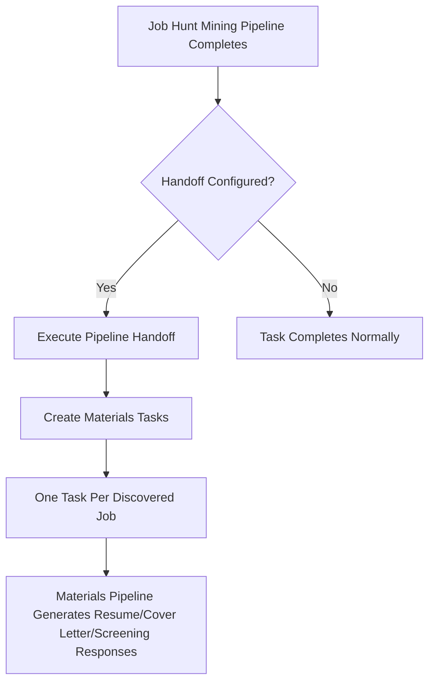
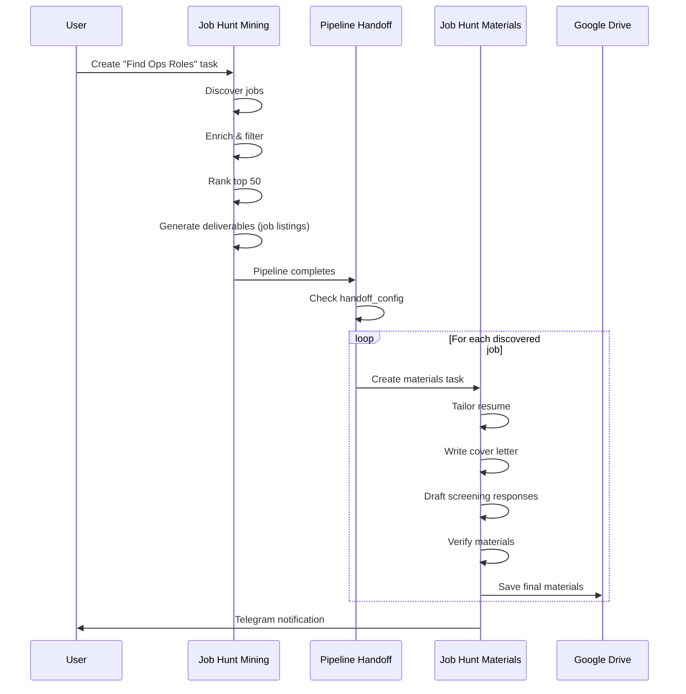

# Pipeline Handoff System

## Overview

The Pipeline Handoff System enables automatic cross-pipeline task creation when a pipeline completes. This is the mechanism that allows the `job-hunt-mining` pipeline to automatically spawn `job-hunt-materials` tasks for each discovered job.

## How It Works



## Configuration

### Database Schema

Add a `handoff_config` JSONB column to the `workflow_templates` table:

```sql
ALTER TABLE workflow_templates ADD COLUMN handoff_config JSONB;
```

### Handoff Configuration Format

```json
{
  "enabled": true,
  "target_template_slug": "job-hunt-materials",
  "create_task_per_deliverable": true,
  "task_title_template": "Materials: {{deliverable_title}}",
  "carry_over_deliverables": true,
  "require_approval": false
}
```

### Configuration Options

| Option | Type | Description |
|--------|------|-------------|
| `enabled` | boolean | Whether handoff is active for this template |
| `target_template_slug` | string | The slug of the template to spawn tasks in |
| `create_task_per_deliverable` | boolean | If true, creates one task per deliverable; if false, creates a single task |
| `task_title_template` | string | Template for task titles. Supports `{{source_title}}`, `{{deliverable_title}}`, `{{company_name}}` |
| `carry_over_deliverables` | boolean | Whether to copy deliverables from source task to new tasks |
| `require_approval` | boolean | If true, tasks start in 'planning' status; if false, they start 'assigned' |

## Setting Up Job Hunt Pipeline Handoff

### Step 1: Add the handoff_config column

```sql
ALTER TABLE workflow_templates 
ADD COLUMN IF NOT EXISTS handoff_config JSONB;
```

### Step 2: Configure the job-hunt-mining template

```sql
UPDATE workflow_templates 
SET handoff_config = '{
  "enabled": true,
  "target_template_slug": "job-hunt-materials",
  "create_task_per_deliverable": true,
  "task_title_template": "Materials: {{deliverable_title}}",
  "carry_over_deliverables": true,
  "require_approval": true
}'::jsonb
WHERE slug = 'job-hunt-mining';
```

### Step 3: Ensure job-hunt-materials template exists

The `job-hunt-materials` template should have these roles in order:
1. `resume-tailor` (Stage 1)
2. `cover-letter-writer` (Stage 2)
3. `screening-writer` (Stage 3)
4. `materials-verifier` (Stage 4)

## Workflow

### Complete Job Hunt Workflow



## Code Implementation

### Key Files

- `src/lib/pipeline-handoff.ts` - Handoff logic and execution
- `src/app/api/webhooks/agent-completion/route.ts` - Webhook integration
- `scripts/seed-openclaw-agents.ts` - Agent definitions

### Handoff Execution Flow

1. **Task Completion**: When an agent completes a task, the `agent-completion` webhook is called
2. **Pipeline Check**: The webhook calls `processPipelineCompletion()` to check for handoff rules
3. **Handoff Logic**: If configured, `executePipelineHandoff()` creates new tasks in the target pipeline
4. **Task Creation**: New tasks are created with proper assignments and deliverables copied over
5. **Auto-Dispatch**: Tasks are automatically dispatched to the first agent in the target pipeline

## Example: Manual Trigger

If you prefer manual control over the handoff, set `require_approval: true`:

```json
{
  "enabled": true,
  "target_template_slug": "job-hunt-materials",
  "create_task_per_deliverable": true,
  "require_approval": true
}
```

With this configuration:
1. Job hunt mining completes and creates materials tasks in "planning" status
2. You review the discovered jobs in Mission Control
3. You approve (assign) the materials tasks you want to proceed with
4. Only approved tasks enter the materials pipeline

## Troubleshooting

### Handoff Not Working

1. Check that `handoff_config` is properly set in the database
2. Verify the target template exists and has roles defined
3. Ensure agents are deployed for the target template
4. Check the webhook logs for handoff errors

### Tasks Not Created

1. Verify `enabled: true` in the handoff config
2. Check that source task has deliverables (if `create_task_per_deliverable: true`)
3. Review the `events` table for handoff-related events

## Integration with OpenClaw

The handoff system works seamlessly with OpenClaw's agent-to-agent delegation:

1. **jh-reporter** (last stage of mining) reports completion to Mission Control
2. Mission Control webhook triggers the handoff
3. New tasks are created and auto-dispatched to **jm-resume-tailor**
4. The materials pipeline progresses through its 4 stages
5. Each agent creates deliverables visible in Mission Control

## Future Enhancements

- **Conditional Handoff**: Only hand off jobs meeting certain criteria (e.g., salary > $70k)
- **Batch Handoff**: Group multiple jobs into a single materials task
- **Smart Scheduling**: Schedule materials creation based on application deadlines
- **Feedback Loop**: Use materials verification results to improve mining criteria